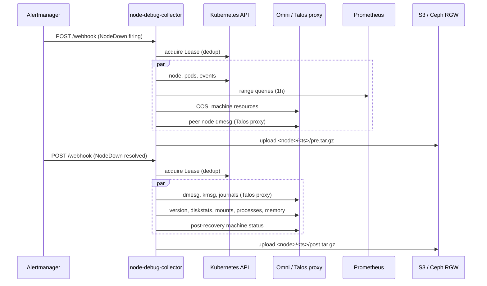

# node-debug-collector

An Alertmanager webhook receiver that automatically captures node diagnostics when a Kubernetes node goes down. When a `NodeDown` alert fires, it collects logs, metrics, and machine state from both Kubernetes and Talos via the [Omni](https://omni.siderolabs.com) proxy, then uploads a compressed archive to S3-compatible storage.

## How it works

Alertmanager routes `NodeDown` alerts to the webhook endpoint. The collector handles two phases:

- **pre** (alert firing): collects Kubernetes node state, pod list, cluster events, Prometheus metrics for the past hour, Omni machine resources, and dmesg from healthy peer nodes — all while the node is still reachable from the control plane.
- **post** (alert resolved): collects Talos machine logs, dmesg, kernel messages, and machine info (memory, mounts, processes, disk stats) from the recovered node.

Each collection run is deduplicated across replicas using a Kubernetes `coordination.k8s.io/v1` Lease, keyed by `(node, phase, alert startsAt)`. The resulting archive is uploaded to an S3 bucket at `<node>/<rfc3339-timestamp>/<phase>.tar.gz`.



## Prerequisites

- Kubernetes cluster running [Talos Linux](https://talos.dev) managed by [Omni](https://omni.siderolabs.com)
- An Omni service account key with access to the target cluster (no 8-hour rotation required — the Omni SA auth bypasses client-side lifetime validation)
- An S3-compatible bucket (the manifests use a Rook/Ceph [ObjectBucketClaim](https://rook.io/docs/rook/latest/Storage-Configuration/Object-Storage-RGW/object-storage/))
- [External Secrets Operator](https://external-secrets.io) if using the provided `ExternalSecret` manifests

## Configuration

All configuration is via environment variables.

| Variable | Default | Description |
|---|---|---|
| `LISTEN_ADDR` | `:8080` | HTTP listen address |
| `OMNI_ENDPOINT` | — | **Required.** Omni API URL (e.g. `https://omni.example.com`) |
| `OMNI_SERVICE_ACCOUNT_KEY_FILE` | `/etc/omni/sa-key` | Path to Omni service account key file |
| `OMNI_CLUSTER` | `prod` | Omni cluster name |
| `TALOS_PEERS` | — | Comma-separated Talos node hostnames for peer dmesg collection |
| `PROMETHEUS_URL` | `http://prometheus-kube-prometheus-prometheus.prometheus.svc:9090` | Prometheus base URL |
| `HA_URL` | `https://ha.example.com` | Home Assistant base URL for alert forwarding |
| `HA_WEBHOOK_ID` | — | Home Assistant webhook ID; forwarding is skipped if unset |
| `FORWARD_HA` | `true` | Set to `false` to disable Home Assistant forwarding |
| `LEASE_TTL` | `30m` | How long a collection lease is held (dedup window) |
| `POD_NAMESPACE` | `node-debug` | Namespace for Kubernetes Lease objects |
| `POD_NAME` | `node-debug-collector` | Identity for Kubernetes Lease holder |
| `BUCKET_HOST` | — | S3 endpoint hostname (from ObjectBucketClaim ConfigMap) |
| `BUCKET_PORT` | `80` | S3 endpoint port |
| `BUCKET_NAME` | — | S3 bucket name |
| `BUCKET_REGION` | `us-east-1` | S3 region |
| `AWS_ACCESS_KEY_ID` | — | S3 credentials (from ObjectBucketClaim Secret) |
| `AWS_SECRET_ACCESS_KEY` | — | S3 credentials (from ObjectBucketClaim Secret) |

## Deployment

```bash
# Edit deploy/ manifests to replace placeholder values, then:
kubectl apply -k deploy/
```

See the `# REPLACE` comments in `deploy/deployment.yaml` and `deploy/external-secret.yaml`. The `ExternalSecret` manifests assume a 1Password-backed ClusterSecretStore — adapt for your own secret store if needed.

## Building

The project uses [ko](https://ko.build) to build and push container images:

```bash
export KO_DOCKER_REPO=ghcr.io/yourorg/node-debug-collector
ko build .
```

## Smoketest

Verify that a service account key can reach the Talos Machine API via the Omni proxy before deploying:

```bash
export OMNI_ENDPOINT=https://omni.example.com
go run ./cmd/smoketest <path/to/sa-key> <cluster-name> <node-hostname>
```

## License

Apache 2.0 — see [LICENSE](LICENSE).
